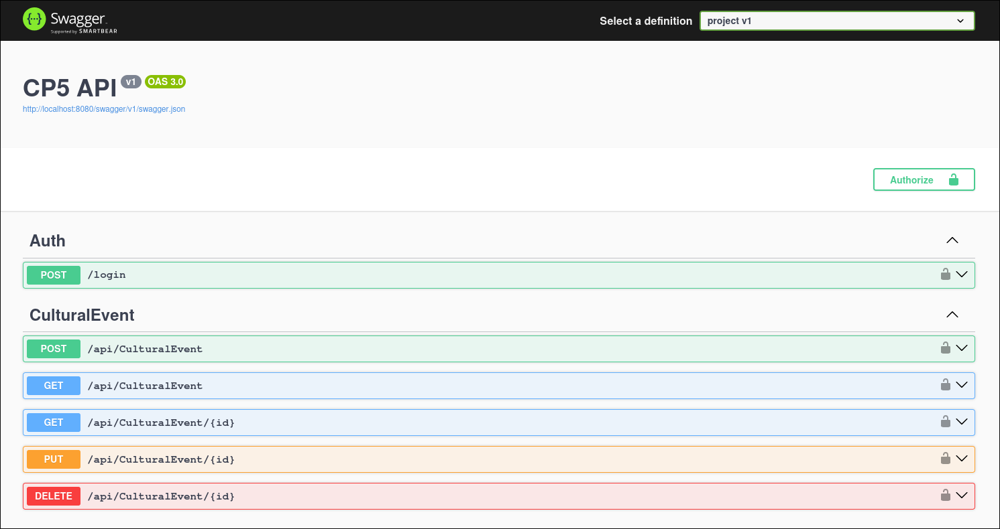

# CP5 .NET | Eventos Culturais

## Integrantes
| Nome                    |   RM   |
|-------------------------|--------|
| Otavio Miklos Nogueira  | 554513 |
| Luciayla Yumi Kawakami  | 557987 |
| Nathália Gomes da Silva | 554945 |

## Links
- Youtube: [https://youtu.be/f6sIjeu1WxI](https://youtu.be/f6sIjeu1WxI)

## Prints / Código

### Program.cs

```csharp
using System.Text;
using cp5.Models;
using cp5.Services;
using Microsoft.Extensions.Options;
using MongoDB.Driver;
using MongoDatabaseSettings = cp5.Data.MongoDatabaseSettings;
using Microsoft.AspNetCore.Authentication.JwtBearer;
using Microsoft.IdentityModel.Tokens;
using Microsoft.OpenApi.Models;

var builder = WebApplication.CreateBuilder(args);

// Add services to the container.

builder.Services.AddControllers();
// Learn more about configuring OpenAPI at https://aka.ms/aspnet/openapi
builder.Services.AddOpenApi();
builder.Services.AddSwaggerGen(c =>
{
    c.SwaggerDoc("v1", new OpenApiInfo { Title = "CP5 API", Version = "v1" });
    c.AddSecurityDefinition("Bearer", new OpenApiSecurityScheme
    {
        Name = "Authorization",
        Type = SecuritySchemeType.ApiKey,
        Scheme = "Bearer",
        BearerFormat = "JWT",
        In = ParameterLocation.Header,
        Description = "JWT Authorization header using the Bearer scheme."
    });
    c.AddSecurityRequirement(new OpenApiSecurityRequirement
    {
        {
            new OpenApiSecurityScheme
            {
                Reference = new OpenApiReference
                {
                    Type = ReferenceType.SecurityScheme,
                    Id = "Bearer"
                }
            },
            Array.Empty<string>()
        }
    });
});

var key = Encoding.ASCII.GetBytes(builder.Configuration.GetSection("JWT").GetSection("Key").Value);

builder.Services.AddAuthentication(options =>
    {
        options.DefaultAuthenticateScheme = JwtBearerDefaults.AuthenticationScheme;
        options.DefaultChallengeScheme = JwtBearerDefaults.AuthenticationScheme;
    })
    .AddJwtBearer(options =>
    {
        options.RequireHttpsMetadata = false;
        options.SaveToken = true;
        options.TokenValidationParameters = new TokenValidationParameters
        {
            ValidateIssuerSigningKey = true,
            IssuerSigningKey = new SymmetricSecurityKey(key),
            ValidateIssuer = false,
            ValidateAudience = false
        };
    });

builder.Services.Configure<MongoDatabaseSettings>(
    builder.Configuration.GetSection("MongoDB"));

builder.Services.AddSingleton<IMongoClient>(sp =>
{
    var config = sp.GetRequiredService<IOptions<MongoDatabaseSettings>>().Value;
    return new MongoClient(config.ConnectionString);
});

builder.Services.AddSingleton(sp =>
{
    var config = sp.GetRequiredService<IOptions<MongoDatabaseSettings>>().Value;
    var client = sp.GetRequiredService<IMongoClient>();
    var database = client.GetDatabase(config.DatabaseName);
    return database.GetCollection<CulturalEvent>(config.CollectionName);
});

builder.Services.AddSingleton<CulturalEventService>();

var app = builder.Build();

// Configure the HTTP request pipeline.
app.UseSwagger();
app.UseSwaggerUI();
app.MapOpenApi();

app.UseHttpsRedirection();

app.UseAuthorization();

app.MapControllers();

app.Run();
```

### Swagger


